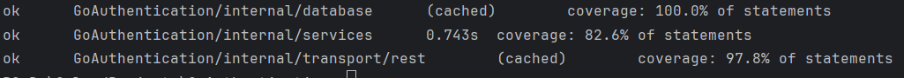
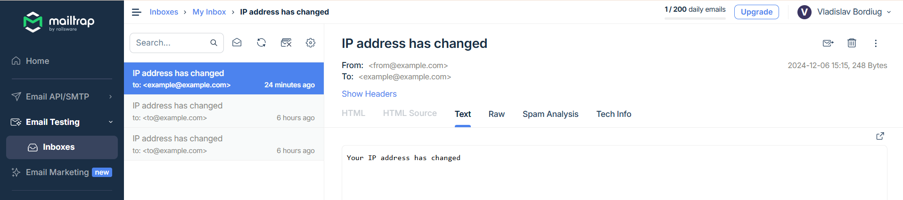

# Сервис аутентификации

## Переменные окружения
Переменные хранятся в [.env](.env) файле.
+ ```DATABASE_URL``` - URL к базе данных PostgreSQL
+ ```SECRET_KEY``` - секретный ключ для генерации подписей JWT токенов
+ ```SERVER_IP``` - IP сервера в ListenAndServe
+  ```SERVER_PORT``` порт сервера в ListenAndServe
+  ```MAILTRAP_USERNAME``` - username для рассылок через Mailtrap
+  ```MAILTRAP_PASSWORD``` - пароль для рассылок через Mailtrap
+  ```FROM_EMAIL``` - E-mail, с которого отправляются письма через Mailtrap

## Развертывание
[Dockerfile](Dockerfile) для сервера, развертываются база данных и сервер с помощью [docker-compose.yml](docker-compose.yml).

## Модульные тесты
Тесты в [database_test.go](internal/database/database_test.go), [services_test.go](internal/services/services_test.go) и [handlers_test.go](internal/transport/rest/handlers_test.go).

Покрытие 80%+.



## Документация
Документация в [docs.go](docs/docs.go), [swagger.json](docs/swagger.json) и [swagger.yaml](docs/swagger.yaml).

## Маршруты
+ /create - обработчик CreateTokens, создает access и refresh JWT токены (refresh тоже JWT, т.к. его нельзя изменить на стороне клиента и подделать, секрет известен только серверу) по передаваемым в JSON guid и email, метод POST.
+ /refresh - обработчик RefreshTokens, рефрешит access и refresh токены по переданному refresh токену в заголовке X-Refresh-Token, помечает в таблице как used (по id) и выдает новые, метод GET.

## База данных
В базе данных хранятся:
+ id токенов (который содержится в payload и одинаковый для access и рефреш токенов)
+ bcrypt хеш для подписи JWT refresh токена (т.к. bcrypt принимает максимум 72 байта, то bcrypt от всего токена не вычислить, использовался SHA256) 
+ статус (used, unused, blocked и тд).

## Отправка E-mail при смене IP

При смене IP отправляется E-mail на электронную почту, для этого использовался Mailtrap.
